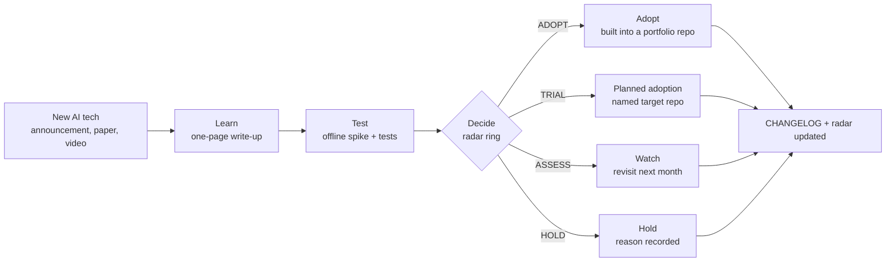

# AI Learning Lab

[](https://github.com/jagadishmazure-jpg/Jagadish-ai-learning-lab/actions/workflows/ci.yml)

How I keep up with new AI technology and decide what to use. Each new tool, paper or platform
gets a short, runnable spike and a one-page write-up with real numbers and a verdict. The ones
that earn it are adopted into my portfolio repositories, and the page links to where.

## At a glance (for recruiters)

Every topic goes through the same four steps, usually within days of the announcement:

1. **Learn:** read the primary source and write a one-page summary in my own words: what it is,
   why an enterprise would care.
2. **Test:** build a small, offline, deterministic spike that isolates the core idea, compared
   against a baseline, with tests.
3. **Decide:** put it on the tech radar (ADOPT / TRIAL / ASSESS / HOLD) with the numbers behind the
   call and the limits of what the spike shows.
4. **Adopt:** if it earns ADOPT, build it into a real project and link it; TRIAL items name where
   they are planned to go.

September 2026 at a glance: 4 topics, 2 adopted, 2 in trial, 4 spikes and 49 tests running in CI.



## Tech radar

| Ring | Topic | Month | Headline result | Where it went |
|---|---|---|---|---|
| **ADOPT** | [NVIDIA Open Agent Safety Platform](topics/2026-09-nvidia-open-agent-safety/) | 2026-09 | default-deny + out-of-band kill switch: 6/6 attacks contained, 0/4 false quarantines | [integration platform `src/aiip/safety/`](https://github.com/jagadishmazure-jpg/Jagadish-azure-ai-integration-platform/tree/main/src/aiip/safety) (9/9 contained, 0/4 false, p50 about 0.4-0.7 ms) |
| **ADOPT** | [Five agent architectures + 12 engineering layers](topics/2026-09-five-agent-architectures/) | 2026-09 | 5 labs x 12 layers: 49 implemented, 5 compile-only, 6 declared out of scope, 0 missing | [Jagadish-azure-agent-labs](https://github.com/jagadishmazure-jpg/Jagadish-azure-agent-labs) |
| **TRIAL** | [Jev as a "System 1" classifier](topics/2026-09-jev-system1-classifier/) | 2026-09 | two-tier router: 0.970 accuracy, 16.7% escalated, $0.27 vs $1.50 per 1k (LLM only) | planned: FinOps repo + integration platform router |
| **TRIAL** | [GraphRAG hybrid retrieval](topics/2026-09-graphrag-hybrid-retrieval/) | 2026-09 | hybrid 8/8 vs vector-only 3/8; multi-hop score 1.00 vs 0.25 | partly in [agentic-ai project 15](https://github.com/jagadishmazure-jpg/Jagadish-agentic-ai/tree/main/projects/15-banking-credit-memo) and the [agent platform knowledge layer](https://github.com/jagadishmazure-jpg/Jagadish-azure-agent-platform/tree/main/src/agentplatform/knowledge); planned: unified data layer |

Rings: **ADOPT** use it by default; **TRIAL** worth using where the risk is manageable, adoption
planned; **ASSESS** worth understanding, not yet worth building on; **HOLD** do not start new work
with it (the page says why). No topic is in ASSESS or HOLD yet.

## Honest note: what the spikes are and are not

- Every spike runs **offline** with deterministic mocks, synthetic data and fixed seeds. No API
  keys, no network calls, no cloud account. Clone it and you get the same numbers.
- Mocks stand in for the real products (for example the "LLM" in the Jev spike is a mock with a
  set error rate, and the Jev adapter is a stub that never calls the API). The write-ups say
  exactly what is mocked and what the numbers do not show.
- Hardware features (such as BlueField enforcement in the NVIDIA topic) cannot be reproduced in
  software and are not claimed.
- Spikes are small on purpose: they test one idea well enough to make a decision, not to be a
  product. The adoption repos are where the production-style work lives.

## Add a new topic

```bash
python scripts/new_topic.py 2026-10 my-new-tool "My New Tool"   # copies TEMPLATE/
```

Then, in the new `topics/2026-10-my-new-tool/` folder:

1. Write `README.md` in the template's sections: what it is, why it matters for enterprise, what
   I tested, results (real numbers from the spike), verdict, adopted into, sources (links).
2. Make `spike.py` real: offline, seeded, compared against a baseline, under a few hundred lines.
3. Add tests in `tests/` that pin the headline numbers and prove no network access happens.
4. Add a row to the **Tech radar** table above and an entry under the month in
   [`CHANGELOG.md`](CHANGELOG.md). The repo tests fail until both exist.
5. Run `ruff check . && ruff format --check . && pytest && python scripts/check_links.py`.

The template is in [`TEMPLATE/`](TEMPLATE/README.md); the rules are in
[`CONTRIBUTING.md`](CONTRIBUTING.md).

## Repository layout

| Path | What is there |
|---|---|
| [`topics/`](topics/README.md) | One folder per topic: `README.md` write-up, `spike.py`, `tests/` |
| [`TEMPLATE/`](TEMPLATE/README.md) | Starting point for a new topic |
| [`scripts/`](scripts/README.md) | New-topic generator, link checker, spike runner |
| [`tests/`](tests/README.md) | Repository rules (radar, changelog, READMEs, layout) |
| [`CHANGELOG.md`](CHANGELOG.md) | What was learned and decided, by month |
| [`SECURITY.md`](SECURITY.md) · [`CONTRIBUTING.md`](CONTRIBUTING.md) | Reporting problems, checks every change must pass |

CI (GitHub Actions, [`.github/workflows/ci.yml`](.github/workflows/ci.yml)) runs ruff, pytest,
every spike, and the link check on each push.

## Run it

```bash
git clone https://github.com/jagadishmazure-jpg/Jagadish-ai-learning-lab.git
cd Jagadish-ai-learning-lab
python -m venv .venv && . .venv/bin/activate
pip install -r requirements.txt
pytest                         # all tests, offline
python scripts/run_spikes.py   # every spike, prints its results
```

## Related repositories

[Jagadish-agentic-ai](https://github.com/jagadishmazure-jpg/Jagadish-agentic-ai) ·
[Jagadish-azure-agent-platform](https://github.com/jagadishmazure-jpg/Jagadish-azure-agent-platform) ·
[Jagadish-azure-agent-labs](https://github.com/jagadishmazure-jpg/Jagadish-azure-agent-labs) ·
[Jagadish-azure-ai-integration-platform](https://github.com/jagadishmazure-jpg/Jagadish-azure-ai-integration-platform)

MIT licensed. Written by Jagadish Meduri; source material is linked, not copied.
