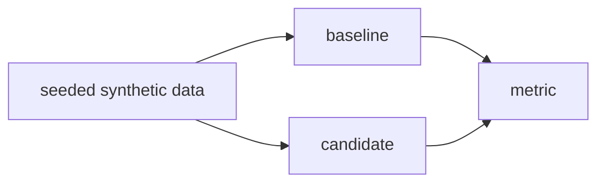

# {{TITLE}}

**Ring: ASSESS** · Spike: [`spike.py`](spike.py) · Tests: [`tests/`](tests/README.md)

> Template for a new topic. Create a copy with `python scripts/new_topic.py <slug> "<Title>"`,
> then replace every instruction below. Write in your own words; link sources instead of quoting
> them. Keep each section short: a topic page is a decision record, not a product manual.

**Sections:** [1. Purpose](#1-purpose) · [2. Architecture](#2-architecture) · [3. How it works](#3-how-it-works) · [4. Key files](#4-key-files) · [5. Code excerpts](#5-code-excerpts) · [6. Configuration](#6-configuration) · [7. Commands](#7-commands) · [8. Real output](#8-real-output) · [9. Tests and eval gates](#9-tests-and-eval-gates) · [10. Guardrails](#10-guardrails) · [11. Security and governance](#11-security-and-governance) · [12. Observability](#12-observability) · [13. Failure modes](#13-failure-modes) · [14. Mapping to Azure services](#14-mapping-to-azure-services) · [15. Limitations](#15-limitations) · [16. Interview talking points](#16-interview-talking-points) · [17. Adopt this](#17-adopt-this)

## 1. Purpose

### What it is

Two or three sentences a non-specialist can follow. Name the vendor or project and the version.

### Why it matters for enterprise

Bullets: the cost, risk, speed or compliance problem it addresses, and for whom.

## 2. Architecture

A mermaid diagram of what the spike builds: inputs, the candidate, the baseline, the metric.



## 3. How it works

What the spike does step by step, what is mocked, the dataset (synthetic, seeded), and the
baseline it is compared against. The spike must run offline and give the same numbers every run.

## 4. Key files

| File | What it does |
|---|---|
| `spike.py` | the experiment |
| `tests/test_spike.py` | determinism and headline-number tests |

## 5. Code excerpts

Paste the core function with a `code:` marker so `scripts/doc_drift.py` keeps it current, for
example `<!-- code: topics/{{TOPIC}}/spike.py::evaluate -->` followed by `<!-- /code -->`.

## 6. Configuration

Command-line flags and constants that change the result.

## 7. Commands

```bash
python spike.py
pytest -q tests
```

## 8. Real output

Add an `output:` marker for `python topics/{{TOPIC}}/spike.py` and run
`python scripts/doc_drift.py`. Then add a `### Results` table and say what the numbers do not show.

## 9. Tests and eval gates

List the tests (an `output:` marker over `pytest --co`) and which numbers they pin.

## 10. Guardrails

What keeps the spike honest: seeds, a baseline, pinned numbers, no network.

## 11. Security and governance

Keys, data, vendor terms and licensing questions the spike raises.

## 12. Observability

What the spike prints or records, and what a production version would measure.

## 13. Failure modes

| Failure | Behavior |
|---|---|
| example | what happens |

## 14. Mapping to Azure services

| Piece | Azure service |
|---|---|
| example | service |

## 15. Limitations

What the spike cannot show (mocks, scale, hardware, real data).

## 16. Interview talking points

Two or three sentences you would say about the decision.

## 17. Adopt this

### Verdict: ASSESS

One of ADOPT / TRIAL / ASSESS / HOLD, with the reason, and what would move it up or down a ring.

### Adopted into

Link to the repo and folder that uses it (ADOPT), or the planned target (TRIAL), or "not adopted".

### Steps

1. The steps a reader would follow to use the idea in their own system.

## Sources

- Author or vendor, linked title of the announcement, paper or article
