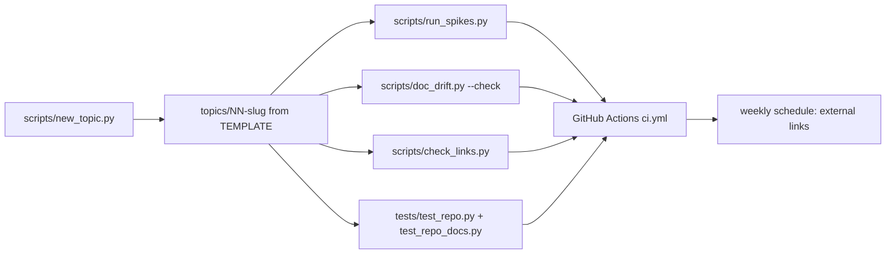

# Lab tooling and repository rules (`scripts/`, `tests/`, CI)

Everything that keeps topics consistent, reproducible and documented.

**Sections:** [1. Purpose](#1-purpose) · [2. Architecture](#2-architecture) · [3. How it works](#3-how-it-works) · [4. Key files](#4-key-files) · [5. Code excerpts](#5-code-excerpts) · [6. Configuration](#6-configuration) · [7. Commands](#7-commands) · [8. Real output](#8-real-output) · [9. Tests and eval gates](#9-tests-and-eval-gates) · [10. Guardrails](#10-guardrails) · [11. Security and governance](#11-security-and-governance) · [12. Observability](#12-observability) · [13. Failure modes](#13-failure-modes) · [14. Mapping to Azure services](#14-mapping-to-azure-services) · [15. Limitations](#15-limitations) · [16. Interview talking points](#16-interview-talking-points) · [17. Adopt this](#17-adopt-this)

## 1. Purpose

The scripts, repository rules and CI that keep the lab consistent as topics are added: scaffolding a topic, running every spike, checking links, and keeping pasted output and code in step with the code.

## 2. Architecture



## 3. How it works

1. `new_topic.py` validates the slug, finds the highest topic number and copies `TEMPLATE/` to the next `NN-slug` folder, filling in the title and folder name.
2. `run_spikes.py` runs every `topics/*/spike.py` from its own folder and exits 1 if any fails.
3. `doc_drift.py` finds `output:` and `code:` markers in the Markdown, re-runs each command or re-reads each function, and rewrites the block; `--check` reports drift and exits 1.
4. `check_links.py` checks every Markdown link against files and GitHub-style heading anchors; `--external` also fetches URLs and fails on 404 or 410.
5. `tests/test_repo.py` enforces topic layout, sections, ring and verdict, radar and changelog entries, folder READMEs and no network imports; `tests/test_repo_docs.py` enforces the docs set, ADRs, CODEOWNERS, no dates or placeholders, and the README test count.

## 4. Key files

| File | What it does |
|---|---|
| `scripts/new_topic.py` | topic scaffold |
| `scripts/run_spikes.py` | run every spike |
| `scripts/doc_drift.py` | generated output and code in docs |
| `scripts/check_links.py` | link checker |
| `tests/test_repo.py` | repository rules |
| `tests/test_repo_docs.py` | documentation standard |
| `.github/workflows/ci.yml` | CI, including the gitleaks secret scan |
| `.github/workflows/codeql.yml` | CodeQL for Python and the workflows |
| `.github/dependabot.yml` | weekly, grouped dependency and action updates |
| `TEMPLATE/` | the starting point for a topic |

## 5. Code excerpts

<!-- code: scripts/new_topic.py::next_number -->
```python
def next_number(root: Path = ROOT) -> str:
    """Two-digit number one higher than the highest existing topic (01 for the first)."""
    names = [p.name for p in (root / "topics").iterdir() if p.is_dir()]
    nums = [int(m.group(1)) for name in names if (m := TOPIC.fullmatch(name))]
    return f"{max(nums, default=0) + 1:02d}"
```
<!-- /code -->

<!-- code: scripts/new_topic.py::create -->
```python
def create(slug: str, title: str, root: Path = ROOT) -> Path:
    if not re.fullmatch(r"[a-z0-9]+(-[a-z0-9]+)*", slug):
        raise ValueError("slug must be lowercase words joined by hyphens")
    if any(p.name[3:] == slug for p in (root / "topics").iterdir() if p.is_dir()):
        raise FileExistsError(slug)
    dest = root / "topics" / f"{next_number(root)}-{slug}"
    shutil.copytree(root / "TEMPLATE", dest, ignore=shutil.ignore_patterns("__pycache__", ".pytest_cache"))
    readme = dest / "README.md"
    text = readme.read_text(encoding="utf-8").replace("{{TITLE}}", title).replace("{{TOPIC}}", dest.name)
    readme.write_text(text, encoding="utf-8")
    return dest
```
<!-- /code -->

<!-- code: scripts/check_links.py::check_local -->
```python
def check_local(md: Path, target: str) -> str | None:
    path, _, frag = target.partition("#")
    dest = (md.parent / path).resolve() if path else md
    if not dest.exists():
        return f"missing target {target}"
    if frag and dest.suffix == ".md" and frag not in anchors(dest):
        return f"missing anchor #{frag} in {dest.relative_to(ROOT)}"
    return None
```
<!-- /code -->

## 6. Configuration

| Setting | Effect |
|---|---|
| `check_links.py --external` | also fetch external URLs |
| `doc_drift.py --check` | report drift instead of rewriting |
| `doc_drift.py <files>` | limit to some Markdown files |
| `ci.yml` schedule | weekly run to catch dead external links |

## 7. Commands

```bash
python scripts/new_topic.py my-new-tool "My New Tool"
python scripts/run_spikes.py
python scripts/doc_drift.py --check
python scripts/check_links.py --external
pytest
```

## 8. Real output

`python scripts/check_links.py` (local links and anchors):

<!-- output: python scripts/check_links.py -->
```text
checked 213 links (0 external URLs fetched): 0 errors, 0 warnings
```
<!-- /output -->

Spike exit codes (`python scripts/run_spikes.py`, last line):

<!-- output: python scripts/run_spikes.py | tail -1 -->
```text
all spikes ran
```
<!-- /output -->

## 9. Tests and eval gates

<!-- output: python -m pytest --co -p no:cacheprovider tests | grep '::' -->
```text
tests/test_repo.py::test_there_are_topics
tests/test_repo.py::test_topic_layout[01-five-agent-architectures]
tests/test_repo.py::test_topic_layout[02-graphrag-hybrid-retrieval]
tests/test_repo.py::test_topic_layout[03-jev-system1-classifier]
tests/test_repo.py::test_topic_layout[04-nvidia-open-agent-safety]
tests/test_repo.py::test_topic_readme_sections_and_ring[01-five-agent-architectures]
tests/test_repo.py::test_topic_readme_sections_and_ring[02-graphrag-hybrid-retrieval]
tests/test_repo.py::test_topic_readme_sections_and_ring[03-jev-system1-classifier]
tests/test_repo.py::test_topic_readme_sections_and_ring[04-nvidia-open-agent-safety]
tests/test_repo.py::test_radar_lists_every_topic_with_matching_ring
tests/test_repo.py::test_changelog_mentions_every_topic
tests/test_repo.py::test_every_folder_has_a_readme
tests/test_repo.py::test_new_topic_script
tests/test_repo.py::test_link_checker_local_rules
tests/test_repo.py::test_no_network_calls_in_spikes
tests/test_repo_docs.py::test_docs_set_exists
tests/test_repo_docs.py::test_adrs_are_indexed_and_complete
tests/test_repo_docs.py::test_component_docs_have_the_17_sections
tests/test_repo_docs.py::test_codeowners_and_no_github_readme
tests/test_repo_docs.py::test_ci_checks_doc_drift
tests/test_repo_docs.py::test_no_placeholders_or_dates_in_docs
tests/test_repo_docs.py::test_readme_test_count_matches_collection
tests/test_repo_docs.py::test_workflows_are_hardened
```
<!-- /output -->

## 10. Guardrails

- A topic cannot be added without a radar row and a changelog entry.
- A spike that imports an HTTP client or LLM SDK fails the tests.
- Docs cannot drift from output: CI runs `doc_drift.py --check`.

## 11. Security and governance

- `.github/CODEOWNERS` assigns every path to @jagadishmazure-jpg.
- CI has read-only `contents` permission and no secrets; CodeQL alone may write security events.
- Actions are pinned to commit SHAs (checked by `test_workflows_are_hardened`); gitleaks scans the full history.
- No cloud infrastructure ([no-infrastructure.md](../no-infrastructure.md)).

## 12. Observability

CI logs each spike's table and JSON summary; the weekly scheduled run surfaces dead external links as failures or warnings.

## 13. Failure modes

| Failure | Result |
|---|---|
| broken local link or anchor | `check_links.py` error, CI fails |
| external link 404/410 | error with `--external`; other HTTP errors warn |
| spike exits non-zero | `run_spikes.py` fails |
| pasted output stale | `doc_drift.py --check` fails with a diff |
| slug not lowercase-hyphenated | `ValueError` from `new_topic.py` |

## 14. Mapping to Azure services

None by design. If the lab moved to Azure DevOps, the same scripts would run in Azure Pipelines unchanged; nothing here depends on a cloud service.

## 15. Limitations

- Anchor slugs follow GitHub's rules approximately; unusual punctuation in headings may need a manual check.
- External link checks depend on remote sites answering HEAD or GET requests.

## 16. Interview talking points

- Repository rules as tests make the process self-enforcing.
- Generated output means a page can never show numbers the code does not produce.

## 17. Adopt this

1. Copy `scripts/` and `tests/test_repo.py` into your lab.
2. Adjust the section list and rings to your vocabulary.
3. Run the four checks in CI and schedule the external link check weekly.
