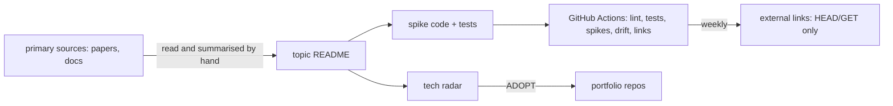

# Threat model

This repository is a learning lab, not a service: four offline, deterministic spikes (agent
architecture comparison, GraphRAG hybrid retrieval, a two-tier "System 1" classifier, an agent-safety
pattern study), a tech radar, a topic template and a few scripts (`new_topic.py`, `run_spikes.py`,
`doc_drift.py`, `check_links.py`). Nothing is hosted and there is no infrastructure (see
[`no-infrastructure.md`](../no-infrastructure.md)). The realistic threats are to the repository and
its CI, and to the conclusions a reader draws from the spikes. This page names them, with the
control, the test that proves it and an honest status. **Built** means in the code and tested.
**Planned** means it does not exist yet.

Frameworks used: STRIDE for the repository and CI, the OWASP Top 10 for LLM Applications (current list, LLM01 to LLM10) and MITRE ATLAS for the AI
ideas the spikes study. Where a risk only applies to a deployed system, the row says so.

## System and trust boundaries

Boundaries that matter: third-party code installed by `pip` in CI; external URLs the link checker
fetches; spike results that become ADOPT decisions in other repositories.

## STRIDE

| Threat | Example in this repo | Control | Evidence | Status |
|---|---|---|---|---|
| Spoofing | A commit or PR impersonates the author | `main` ruleset (no force-push or deletion; CI required on pull requests); CODEOWNERS | `test_codeowners_and_no_github_readme` | Built |
| Tampering | A spike's numbers are edited by hand to flip a verdict | Spikes are deterministic and re-run in CI; docs are regenerated and drift fails the build | `test_spike_is_deterministic` (template), `test_ci_checks_doc_drift` | Built |
| Tampering | A dependency or action is swapped for a malicious one | `requirements.txt` pins, SHA-pinned actions, Dependabot, CodeQL, gitleaks, SBOM | `test_workflows_are_hardened` | Built |
| Repudiation | "Why was this adopted?" | Every topic has a verdict with numbers and limits; the CHANGELOG records each batch; ADRs index decisions | `test_changelog_mentions_every_topic`, `test_adrs_are_indexed_and_complete` | Built |
| Information disclosure | A secret lands in the repo | gitleaks over the full history; push protection | `ci.yml` `secrets` job | Built |
| Denial of service | Not applicable: nothing is served | Not applicable | Not applicable | Not applicable |
| Elevation of privilege | A workflow gets write access it does not need | Every workflow starts from `permissions: contents: read` | `test_workflows_are_hardened` | Built |

## OWASP Top 10 for LLM Applications

Most of these risks apply to deployed LLM systems. The lab's job is to study controls for them; the
column "Where the lab touches it" says which spike does.

| Risk | Where the lab touches it | Control in the lab | Status |
|---|---|---|---|
| LLM01 Prompt injection | Topic 04 studies containment of injected agent actions | Default deny and named-rule decisions (`test_default_deny_refuses_unknown_action`, `test_allow_decision_names_the_rule`); attack steps never released (`test_attack_step_is_never_released`) | Built (simulation) |
| LLM02 Sensitive information disclosure | Topic 04: one actor's data never reaches another | `test_other_actor_gets_nothing` | Built (simulation) |
| LLM03 Supply chain | The repo's own dependencies and actions | Pins, SHA-pinned actions, Dependabot, SBOM, CodeQL | Built |
| LLM04 Data and model poisoning | Not studied yet | None | Not applicable yet |
| LLM05 Improper output handling | Topic 03: model choices are parsed into a closed set with probabilities | `test_choice_probabilities_sum_to_one` | Built |
| LLM06 Excessive agency | Topic 04: kill switch | `test_kill_switch_blocks_all_later_actions` | Built (simulation) |
| LLM07 System prompt leakage | Not studied | None | Not applicable |
| LLM08 Vector and embedding weaknesses | Topic 02: vector-only retrieval is weak on multi-hop questions | `test_vector_only_is_fine_single_hop_but_weak_multi_hop` | Built (finding, not a control) |
| LLM09 Misinformation | Topic 03 measures calibration (ECE) before trusting a cheap tier | `test_reliability_and_ece` | Built |
| LLM10 Unbounded consumption | Topic 03 compares cost of two-tier routing with LLM-only | `test_two_tier_beats_tier1_and_costs_far_less_than_llm_only` | Built |

## MITRE ATLAS

| Technique | Where it matters | Control |
|---|---|---|
| AI supply chain compromise (AML.T0010) | A poisoned package in the spikes' environment | Pins, SBOM, CodeQL; spikes make no network calls (`test_no_network_calls_in_spikes`) |
| LLM prompt injection (AML.T0051) | Topic 04's attack scenarios | Containment study with detectors (`test_expected_detectors`) |
| Exfiltration via AI agent tool invocation (AML.T0086) | Topic 04 | Per-actor isolation in the simulation |
| Evade AI model (AML.T0015) | Topic 04: tampered telemetry hiding an attack | `test_telemetry_chain_detects_tampering` |

## Residual risks

* Spikes are small and synthetic by design; a verdict can be wrong at production scale. Each topic
  page lists its limits.
* The weekly external link check fetches third-party URLs from CI; it only reads status codes.
* The JEV adapter in topic 03 is a stub that never opens a socket (`test_jev_adapter_is_a_stub_and_never_opens_a_socket`); a
  real integration would need its own threat model.
