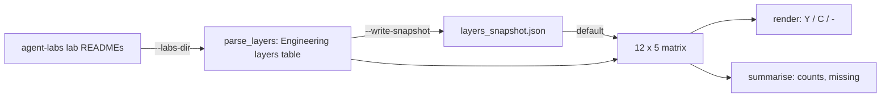

# Five advanced agent architectures and the 12 engineering layers

**Ring: ADOPT** · Spike: [`spike.py`](spike.py) · Tests: [`tests/`](tests/README.md)

**Sections:** [1. Purpose](#1-purpose) · [2. Architecture](#2-architecture) · [3. How it works](#3-how-it-works) · [4. Key files](#4-key-files) · [5. Code excerpts](#5-code-excerpts) · [6. Configuration](#6-configuration) · [7. Commands](#7-commands) · [8. Real output](#8-real-output) · [9. Tests and eval gates](#9-tests-and-eval-gates) · [10. Guardrails](#10-guardrails) · [11. Security and governance](#11-security-and-governance) · [12. Observability](#12-observability) · [13. Failure modes](#13-failure-modes) · [14. Mapping to Azure services](#14-mapping-to-azure-services) · [15. Limitations](#15-limitations) · [16. Interview talking points](#16-interview-talking-points) · [17. Adopt this](#17-adopt-this)

## 1. Purpose

### What it is

A framing for agent projects that go beyond a chat-plus-RAG demo. Five use cases, each stressing a
different capability:

| Use case | The hard part it exercises |
|---|---|
| Multi-signal fusion | combining several noisy, differently timed sensor streams into one risk estimate |
| Multimodal RAG | retrieving and reasoning over images plus text, with calibrated confidence |
| Graph reasoning | planning over a network (roads, assets) where the structure is the knowledge |
| Document intelligence | layout, tables and clauses from messy documents, checked by an auditor agent |
| Continual learning with context gating | learning from evaluated outcomes, but only letting vetted lessons into context |

Alongside it, a checklist of 12 engineering layers every serious agent system has to address:
business understanding, data understanding, knowledge, model, context, semantic, agent, loop,
evaluation, harness, infrastructure engineering, and continual learning.

### Why it matters for enterprise

- The layers make "production ready" concrete. A demo usually covers agent and model engineering
  only; audits, incidents and cost overruns come from the other ten.
- The five use cases map onto real industries (public safety, healthcare research, public works,
  legal/compliance, energy) and each forces a different retrieval and evaluation design.
- Marking each layer implemented / not in scope per project is an honest way to show coverage to
  a reviewer or a customer.

## 2. Architecture



## 3. How it works

Nothing new was built for this topic; the five architectures were built as full labs, and this
spike checks the coverage claim. [`spike.py`](spike.py) parses the "Engineering layers" table in
each lab README of
[Jagadish-azure-agent-labs](https://github.com/jagadishmazure-jpg/Jagadish-azure-agent-labs)
and prints a 12 x 5 matrix. By default it reads the committed snapshot
[`layers_snapshot.json`](layers_snapshot.json) so it runs offline; `--labs-dir` parses a clone and
`--write-snapshot` refreshes the snapshot.

## 4. Key files

| File | What it does |
|---|---|
| `spike.py` | parses the layer tables, builds and prints the matrix and summary |
| `layers_snapshot.json` | committed copy of the parsed tables, so the spike runs offline |
| `tests/test_spike.py` | parser, snapshot and headline-number tests |

## 5. Code excerpts

<!-- code: topics/01-five-agent-architectures/spike.py::parse_layers -->
```python
def parse_layers(markdown: str) -> dict[str, str]:
    """Return {layer: status} from the 'Engineering layers' table (a ## or ### heading) of a lab README."""
    m = re.search(r"^#{2,3} Engineering layers\s*$(.*?)(?=^#{2,3} |\Z)", markdown, re.M | re.S)
    if not m:
        raise ValueError("no 'Engineering layers' section")
    out: dict[str, str] = {}
    for line in m.group(1).splitlines():
        cells = [c.strip() for c in line.strip().strip("|").split("|")]
        if len(cells) >= 2 and cells[0] in LAYERS:
            out[cells[0]] = normalise(cells[1])
    return out
```
<!-- /code -->

<!-- code: topics/01-five-agent-architectures/spike.py::summarise -->
```python
def summarise(matrix: dict[str, dict[str, str]]) -> dict:
    cells = [matrix[lab].get(layer, "missing") for lab in matrix for layer in LAYERS]
    return {
        "labs": len(matrix),
        "layers": len(LAYERS),
        "cells": len(cells),
        "implemented": cells.count("implemented"),
        "compile_only": cells.count("compile-only"),
        "not_in_scope": cells.count("not in scope"),
        "missing": cells.count("missing"),
        "layers_covered_by_at_least_one_lab": sum(
            any(matrix[lab].get(layer) in ("implemented", "compile-only") for lab in matrix)
            for layer in LAYERS
        ),
    }
```
<!-- /code -->

## 6. Configuration

| Flag | Effect |
|---|---|
| (none) | read `layers_snapshot.json` |
| `--labs-dir PATH` | parse the lab READMEs in a local clone of the agent-labs repo |
| `--write-snapshot` | with `--labs-dir`, refresh the snapshot |

## 7. Commands

```bash
python spike.py
python spike.py --labs-dir /path/to/Jagadish-azure-agent-labs/labs
pytest -q tests
```

From the repository root: `python topics/01-five-agent-architectures/spike.py`.

## 8. Real output

`python topics/01-five-agent-architectures/spike.py`:

<!-- output: python topics/01-five-agent-architectures/spike.py -->
```text
multi-signal fusion                      -> labs/disaster-signal-fusion
multimodal RAG                           -> labs/medical-eye-scan-multimodal
graph reasoning                          -> labs/road-network-maintenance-graph
document intelligence                    -> labs/legal-document-compliance
continual learning with context gating   -> labs/wind-turbine-continual-learning
layer                         disaster   medical      road     legal      wind
Business understanding               Y         Y         Y         Y         Y
Data understanding                   Y         Y         Y         Y         Y
Knowledge engineering                Y         Y         Y         Y         Y
Model engineering                    Y         Y         Y         Y         Y
Context engineering                  Y         Y         Y         Y         Y
Semantic engineering                 Y         Y         Y         Y         Y
Agent engineering                    Y         Y         Y         Y         Y
Loop engineering                     -         -         Y         Y         Y
Evaluation engineering               Y         Y         Y         Y         Y
Harness engineering                  Y         Y         Y         Y         Y
Infrastructure engineering           C         C         C         C         C
Continual learning                   -         -         -         -         Y
Y implemented · C implemented, compile-only (IaC validated, not deployed) · - not in scope
{
  "labs": 5,
  "layers": 12,
  "cells": 60,
  "implemented": 49,
  "compile_only": 5,
  "not_in_scope": 6,
  "missing": 0,
  "layers_covered_by_at_least_one_lab": 12
}
```
<!-- /output -->

### Results

From `python spike.py`:

| Metric | Result |
|---|---|
| Labs x layers | 5 x 12 = 60 cells, 0 missing |
| Implemented | 49 |
| Implemented, compile-only (Bicep + Terraform validated, not deployed) | 5 (infrastructure, every lab) |
| Not in scope (declared) | 6 (loop engineering in 2 labs, continual learning in 4) |
| Layers covered by at least one lab | 12 / 12 |

Continual learning is implemented only in the wind-turbine lab, by design; the other labs point to
it rather than faking a feedback loop.

## 9. Tests and eval gates

<!-- output: python -m pytest --co -p no:cacheprovider topics/01-five-agent-architectures/tests | grep '::' -->
```text
topics/01-five-agent-architectures/tests/test_spike.py::test_parse_layers_reads_only_the_section
topics/01-five-agent-architectures/tests/test_spike.py::test_parse_layers_accepts_a_subsection_heading
topics/01-five-agent-architectures/tests/test_spike.py::test_missing_section_is_an_error
topics/01-five-agent-architectures/tests/test_spike.py::test_unknown_status_is_an_error
topics/01-five-agent-architectures/tests/test_spike.py::test_snapshot_covers_five_labs_by_twelve_layers
topics/01-five-agent-architectures/tests/test_spike.py::test_only_the_turbine_lab_does_continual_learning
topics/01-five-agent-architectures/tests/test_spike.py::test_render_has_a_row_per_layer
```
<!-- /output -->

CI runs these tests and the spike itself (`scripts/run_spikes.py`) on every push; the headline numbers above are pinned in the tests.

## 10. Guardrails

- The snapshot is regenerated from the real READMEs, not typed by hand.
- An unknown status string is an error, so a typo cannot silently count as implemented.
- Missing cells are counted and reported.

## 11. Security and governance

- No network access; the spike reads local files only.
- The idea source is linked; the layer definitions and labs are original work.

## 12. Observability

The summary JSON (`implemented`, `compile_only`, `not_in_scope`, `missing`) is the metric; CI runs the spike on every push.

## 13. Failure modes

| Failure | Behavior |
|---|---|
| lab README has no Engineering layers table | `ValueError` |
| unknown status text | `ValueError` naming the status |
| snapshot out of date | numbers differ from a `--labs-dir` run; refresh with `--write-snapshot` |

## 14. Mapping to Azure services

| Layer | Where the labs map it on Azure |
|---|---|
| model, context, agent | Azure AI Foundry, Microsoft Agent Framework |
| knowledge | Azure AI Search, Cosmos DB |
| evaluation | eval gates in GitHub Actions; Foundry evaluations |
| infrastructure | Bicep and Terraform, compile-only |
| continual learning | eval-gated promotion (wind-turbine lab) |

## 15. Limitations

- The matrix measures what the READMEs claim; the labs' own tests are what back the claims.
- Status is coarse: implemented does not say how deep.

## 16. Interview talking points

- Twelve layers turn "production ready" into a checklist a reviewer can verify.
- Declaring a layer out of scope is better than faking it.

## 17. Adopt this

### Verdict: ADOPT

The framing is now how every lab is documented and reviewed. It turned vague "production-grade"
claims into a table a reviewer can check against code.

### Adopted into

[Jagadish-azure-agent-labs](https://github.com/jagadishmazure-jpg/Jagadish-azure-agent-labs):
[disaster-signal-fusion](https://github.com/jagadishmazure-jpg/Jagadish-azure-agent-labs/tree/main/labs/disaster-signal-fusion),
[medical-eye-scan-multimodal](https://github.com/jagadishmazure-jpg/Jagadish-azure-agent-labs/tree/main/labs/medical-eye-scan-multimodal),
[road-network-maintenance-graph](https://github.com/jagadishmazure-jpg/Jagadish-azure-agent-labs/tree/main/labs/road-network-maintenance-graph),
[legal-document-compliance](https://github.com/jagadishmazure-jpg/Jagadish-azure-agent-labs/tree/main/labs/legal-document-compliance),
[wind-turbine-continual-learning](https://github.com/jagadishmazure-jpg/Jagadish-azure-agent-labs/tree/main/labs/wind-turbine-continual-learning).

### Steps

1. Add an Engineering layers table to each agent project README.
2. Use the three statuses only: implemented, compile-only, not in scope.
3. Run the parser in CI so the matrix stays honest.

## Sources

- Idea source: Maryam Miradi, a YouTube video on five agent projects worth building. The labs,
  the layer definitions as written in them, and this write-up are my own.
