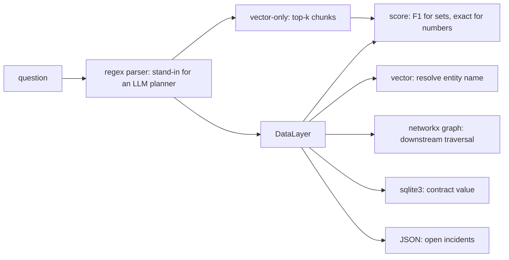

# GraphRAG: hybrid retrieval behind one data access layer

**Ring: TRIAL** · Spike: [`spike.py`](spike.py) · Tests: [`tests/`](tests/README.md)

**Sections:** [1. Purpose](#1-purpose) · [2. Architecture](#2-architecture) · [3. How it works](#3-how-it-works) · [4. Key files](#4-key-files) · [5. Code excerpts](#5-code-excerpts) · [6. Configuration](#6-configuration) · [7. Commands](#7-commands) · [8. Real output](#8-real-output) · [9. Tests and eval gates](#9-tests-and-eval-gates) · [10. Guardrails](#10-guardrails) · [11. Security and governance](#11-security-and-governance) · [12. Observability](#12-observability) · [13. Failure modes](#13-failure-modes) · [14. Mapping to Azure services](#14-mapping-to-azure-services) · [15. Limitations](#15-limitations) · [16. Interview talking points](#16-interview-talking-points) · [17. Adopt this](#17-adopt-this)

## 1. Purpose

### What it is

GraphRAG, in the broad sense used here, means grounding an agent in more than a vector index. The
retriever combines four kinds of access:

- **vector similarity** over text, to find things by meaning and to ground fuzzy names,
- **knowledge-graph traversal**, to follow relationships (owns, supplies, used in, sold to) as far
  as the question needs,
- **relational facts** (SQL), for exact numbers and aggregates,
- **JSON records**, for semi-structured operational data such as incidents or tickets.

All four sit behind one data access layer, so the planner asks for "customers downstream of X" or
"contract value for these products" and never talks to a graph library or a database directly.

### Why it matters for enterprise

- The questions people actually ask are multi-hop: "if this supplier fails, which customers and
  how much revenue?" Vector search returns passages that *look* similar; it does not follow a
  chain, and it cannot add up numbers it did not retrieve.
- Enterprise data already lives in all four shapes. A single access layer lets each store keep
  its own security model and lets the agent's tools stay small and auditable.
- Answers become explainable: the traversal path and the SQL are the citation.

## 2. Architecture



## 3. How it works

[`spike.py`](spike.py) stores a small supply-chain world (a holding company, 3 suppliers, 4
components, 4 products, 4 customers, 6 contracts, 4 incidents) four ways: text notes embedded with
a hashed bag-of-words vector in numpy, a directed graph in networkx, a contracts table in in-memory
sqlite3, and incident records as JSON.

Two answerers get the same 8 questions and the same regex question parser (a stand-in for an LLM
planner, so only the retrieval strategy differs):

- **vector-only:** every fact flattened into 30 text chunks; retrieve top-k and read the answer off
  the retrieved text (entities of the asked type, or the sum of the dollar amounts it sees);
- **hybrid:** vector search to resolve the entity name, then graph traversal, then SQL or JSON
  through the `DataLayer`.

Scoring: F1 for set answers, exact match for numbers. Questions range from 1 hop ("which
components does Apex Metals supply?") to 4 hops ("which customers are affected if Apex Holdings
has an outage?", i.e. holding -> suppliers -> components -> products -> customers).

## 4. Key files

| File | What it does |
|---|---|
| `spike.py` | synthetic supply-chain world, both answerers, the eval and the top-k sweep |
| `tests/test_spike.py` | data layer, scoring and headline-number tests |

## 5. Code excerpts

<!-- code: topics/02-graphrag-hybrid-retrieval/spike.py::DataLayer -->
```python
class DataLayer:
    """One interface over the four stores. Callers never touch networkx or sqlite directly."""

    def __init__(self) -> None:
        self.g = nx.DiGraph()
        for kind, edges in (("owns", OWNS), ("supplies", SUPPLIES), ("used_in", USED_IN)):
            self.g.add_edges_from(edges, rel=kind)
        self.g.add_edges_from(((p, c) for c, p in BUYS), rel="sold_to")  # downstream direction
        self.db = sqlite3.connect(":memory:")
        self.db.execute("CREATE TABLE contracts (customer TEXT, product TEXT, annual_value INT)")
        self.db.executemany("INSERT INTO contracts VALUES (?, ?, ?)", CONTRACTS)
        self.incidents = json.loads(INCIDENTS_JSON)
        self.entities = VectorIndex(sorted(set().union(*TYPES.values())))

    def resolve(self, name: str) -> str:
        return self.entities.search(name, 1)[0]

    def downstream(self, entity: str, of_type: str) -> set[str]:
        return {n for n in nx.descendants(self.g, entity) if n in TYPES[of_type]}

    def contract_value(self, products: set[str]) -> int:
        if not products:
            return 0
        q = "SELECT COALESCE(SUM(annual_value), 0) FROM contracts WHERE product IN (%s)"
        return self.db.execute(q % ",".join("?" * len(products)), sorted(products)).fetchone()[0]

    def open_incidents(self, products: set[str], severity: str = "high") -> set[str]:
        return {
            r["id"]
            for r in self.incidents
            if r["product"] in products and r["status"] == "open" and r["severity"] == severity
        }
```
<!-- /code -->

<!-- code: topics/02-graphrag-hybrid-retrieval/spike.py::answer_hybrid -->
```python
def answer_hybrid(question: str, dl: DataLayer):
    phrase, target, kind = parse(question)
    anchor = dl.resolve(phrase)
    if kind == "entities":
        return frozenset(dl.downstream(anchor, target))
    products = dl.downstream(anchor, "product")
    if kind == "value":
        return dl.contract_value(products)
    return frozenset(dl.open_incidents(products))
```
<!-- /code -->

## 6. Configuration

No flags. Top-k for the vector-only answerer is 4 in the main run; `sweep_k` tries 2, 4, 8 and 12. The hashed embedding uses 512 dimensions.

## 7. Commands

```bash
python spike.py
pytest -q tests
```

From the repository root: `python topics/02-graphrag-hybrid-retrieval/spike.py`.

## 8. Real output

`python topics/02-graphrag-hybrid-retrieval/spike.py`:

<!-- output: python topics/02-graphrag-hybrid-retrieval/spike.py -->
```text
[1 hop] Which components does Apex Metals supply?
    vector-only (1.00): ['motor housing', 'steel frame']
    hybrid      (1.00): ['motor housing', 'steel frame']
[1 hop] Which customers buy the Lumen scanner?
    vector-only (1.00): ['Northwind', 'Tailspin']
    hybrid      (1.00): ['Northwind', 'Tailspin']
[2 hop] Which products depend on Voltcell?
    vector-only (0.50): ['Lumen scanner', 'Orion drone']
    hybrid      (1.00): ['Atlas cart', 'Orion drone']
[3 hop] Which customers are affected if Apex Metals has an outage?
    vector-only (0.00): []
    hybrid      (1.00): ['Contoso Farms', 'Fabrikam', 'Northwind']
[3 hop] What annual contract value is at risk if Voltcell has an outage?
    vector-only (0.00): 1250000
    hybrid      (1.00): 2600000
[4 hop] Which customers are affected if Apex Holdings has an outage?
    vector-only (0.00): []
    hybrid      (1.00): ['Contoso Farms', 'Fabrikam', 'Northwind', 'Tailspin']
[3 hop] Which open high-severity incidents affect products that depend on Kestrel Optics?
    vector-only (1.00): ['INC-1', 'INC-4']
    hybrid      (1.00): ['INC-1', 'INC-4']
[3 hop] What annual contract value is at risk if Kestrel Optics has an outage?
    vector-only (0.00): 1250000
    hybrid      (1.00): 2670000
{
  "questions": 8,
  "top_k": 4,
  "vector_only_mean": 0.438,
  "hybrid_mean": 1.0,
  "vector_only_single_hop": 1.0,
  "vector_only_multi_hop": 0.25,
  "hybrid_multi_hop": 1.0,
  "vector_only_exact": 3,
  "hybrid_exact": 8
}
vector-only mean score by top-k: {2: 0.375, 4: 0.438, 8: 0.521, 12: 0.529}
```
<!-- /output -->

### Results

From `python spike.py` (top-k = 4 for vector-only):

| Metric | Vector-only | Hybrid |
|---|---|---|
| Mean score, all 8 questions | 0.438 | **1.000** |
| Single-hop questions (2) | 1.000 | 1.000 |
| Multi-hop questions (6) | 0.250 | **1.000** |
| Fully correct answers | 3 / 8 | **8 / 8** |
| Contract value at risk, Voltcell outage (gold $2,600,000) | $1,250,000 | $2,600,000 |
| Contract value at risk, Kestrel Optics outage (gold $2,670,000) | $1,250,000 | $2,670,000 |

More context does not close the gap: vector-only mean score is 0.375 / 0.438 / 0.521 / 0.529 at
top-k 2 / 4 / 8 / 12. Larger k brings in more of the right chunks but also more wrong entities.

One honest caveat: vector-only got the incidents question right, but by coincidence. It retrieved
incident notes by similarity and filtered for "open" and "high"; in this dataset every open,
high-severity incident happens to be on a product that depends on the asked supplier.

The world is tiny and the parser is hand-written, so the absolute numbers mean little. The shape of
the result (equal on one hop, a large gap from two hops on) is the finding.

## 9. Tests and eval gates

<!-- output: python -m pytest --co -p no:cacheprovider topics/02-graphrag-hybrid-retrieval/tests | grep '::' -->
```text
topics/02-graphrag-hybrid-retrieval/tests/test_spike.py::test_entity_resolution_uses_vector_similarity
topics/02-graphrag-hybrid-retrieval/tests/test_spike.py::test_graph_traversal_multi_hop
topics/02-graphrag-hybrid-retrieval/tests/test_spike.py::test_sql_and_json_access
topics/02-graphrag-hybrid-retrieval/tests/test_spike.py::test_hybrid_answers_every_question
topics/02-graphrag-hybrid-retrieval/tests/test_spike.py::test_vector_only_is_fine_single_hop_but_weak_multi_hop
topics/02-graphrag-hybrid-retrieval/tests/test_spike.py::test_more_context_does_not_close_the_gap
topics/02-graphrag-hybrid-retrieval/tests/test_spike.py::test_parser_rejects_unknown_questions
topics/02-graphrag-hybrid-retrieval/tests/test_spike.py::test_score_f1
```
<!-- /output -->

CI runs these tests and the spike itself (`scripts/run_spikes.py`) on every push; the headline numbers above are pinned in the tests.

## 10. Guardrails

- Both answerers share the parser, so only retrieval differs.
- Gold answers are fixed in code and pinned by tests.

## 11. Security and governance

- All entities are fictional; nothing leaves the process.
- In a real system each store keeps its own access control behind the data layer.

## 12. Observability

The spike prints per-question scores and the top-k sweep; the traversal path and SQL are the explanation for each hybrid answer.

## 13. Failure modes

| Failure | Behavior |
|---|---|
| entity name not resolved | empty set, scored 0 |
| vector-only on multi-hop | partial sets and wrong sums (the measured gap) |
| coincidental match | noted in the results (incidents question) |

## 14. Mapping to Azure services

| Store | Azure service |
|---|---|
| vector | Azure AI Search vector index |
| graph | Azure Cosmos DB for Apache Gremlin, or a graph in Microsoft Fabric |
| relational | Azure SQL Database |
| JSON | Azure Cosmos DB for NoSQL |
| data layer | a tool service behind API Management |

## 15. Limitations

- Tiny world and a hand-written parser: the shape of the result matters, not the absolute numbers.
- No sync from source systems, no entity resolution at scale, no per-store access control.

## 16. Interview talking points

- Vector search finds similar text; it does not follow chains or add numbers.
- One data layer keeps agent tools small and auditable.

## 17. Adopt this

### Verdict: TRIAL

Clear win on multi-hop and aggregate questions, no loss on simple lookups. It stays in TRIAL
because the hard parts are not in this spike: keeping the graph in sync with source systems,
entity resolution at scale, per-store access control, and letting an LLM planner choose the
access path reliably.

### Adoption status

Partially adopted already:

- [Jagadish-agentic-ai project 15](https://github.com/jagadishmazure-jpg/Jagadish-agentic-ai/tree/main/projects/15-banking-credit-memo)
  (banking credit memo): graph RAG over beneficial ownership over time.
- [Jagadish-azure-agent-platform knowledge layer](https://github.com/jagadishmazure-jpg/Jagadish-azure-agent-platform/tree/main/src/agentplatform/knowledge):
  entity graph alongside search for the mortgage workflow.

Planned: a unified data access layer in the agent platform, shaped like `DataLayer` here (vector,
graph, SQL, JSON behind one interface), replacing store-specific calls in the agents.

### Steps

1. Put every store behind one data access interface with small, typed methods.
2. Resolve names with vector search, then traverse and aggregate in the stores that own the data.
3. Evaluate on multi-hop questions, not only lookups.

## Sources

- Microsoft Research, [GraphRAG project](https://microsoft.github.io/graphrag/) (background on graph-based retrieval)
- NetworkX, [documentation](https://networkx.org/documentation/stable/)
- Python, [sqlite3 module](https://docs.python.org/3/library/sqlite3.html)
