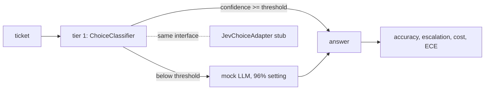

# Jev: a fast "System 1" classifier next to an LLM

**Ring: TRIAL** · Spike: [`spike.py`](spike.py) · Tests: [`tests/`](tests/README.md)

**Sections:** [1. Purpose](#1-purpose) · [2. Architecture](#2-architecture) · [3. How it works](#3-how-it-works) · [4. Key files](#4-key-files) · [5. Code excerpts](#5-code-excerpts) · [6. Configuration](#6-configuration) · [7. Commands](#7-commands) · [8. Real output](#8-real-output) · [9. Tests and eval gates](#9-tests-and-eval-gates) · [10. Guardrails](#10-guardrails) · [11. Security and governance](#11-security-and-governance) · [12. Observability](#12-observability) · [13. Failure modes](#13-failure-modes) · [14. Mapping to Azure services](#14-mapping-to-azure-services) · [15. Limitations](#15-limitations) · [16. Interview talking points](#16-interview-talking-points) · [17. Adopt this](#17-adopt-this)

## 1. Purpose

### What it is

Jev is a hosted choice API from TypeSafe AI. You send a piece of text plus the list of options it
could belong to; it returns the chosen option, a confidence, and a probability for every option.
There is no per-task training: the option list is the task definition.

The useful way to think about it is as a "System 1" (fast, cheap, reflexive) next to an LLM as
"System 2" (slow, expensive, deliberate). Most requests in a real workload are routine decisions
(which queue, which intent, which policy applies). A calibrated classifier can take those, and the
LLM only sees the cases where the classifier is unsure.

### Why it matters for enterprise

- **Cost and latency.** Routing, triage and intent detection are high-volume. Paying LLM prices
  for every one of them is the largest avoidable line in many agent budgets.
- **Predictable output.** A fixed option set cannot produce an off-list answer, which removes a
  class of parsing and validation failures.
- **Calibrated confidence is the control knob.** If the probabilities can be trusted, one
  threshold decides how much traffic escalates, so cost and quality become a setting, not a
  surprise.
- **Vendor risk.** It is a new, closed API; the architecture should let it be swapped for an
  in-house classifier without touching callers.

## 2. Architecture



## 3. How it works

[`spike.py`](spike.py) builds a two-tier router for support tickets (billing / technical / sales):

1. **Data:** 900 synthetic tickets from a fixed seed (600 train, 300 test). About 1 in 5 has no
   class cue at all (only words every class uses) and about 1 in 3 also mentions another class's
   vocabulary, so the easy/hard split is realistic rather than trivially separable.
2. **Tier 1:** TF-IDF (unigrams + bigrams) + logistic regression via scikit-learn; if
   scikit-learn is missing, a multinomial Naive Bayes in numpy. Both sit behind a
   `ChoiceClassifier` interface that returns choice, confidence and per-option probabilities.
3. **Calibration check:** reliability bins (10 bins) and expected calibration error (ECE).
4. **Router:** confidence at or above a threshold keeps the tier-1 answer; below it the ticket
   goes to a **mock LLM**, set to be right on 96% of tickets (errors picked by a hash of the text,
   so runs are repeatable). The 96% is a parameter, not a measurement of any real model.
5. **Cost:** simulated unit prices of $0.00002 per tier-1 call and $0.0015 per LLM call.
6. **Jev adapter:** `JevChoiceAdapter` implements the same interface as a stub. It maps a
   response of that shape onto the `Choice` type, has no key, no endpoint and no HTTP client, and
   always raises if called. A test replaces `socket` to prove no network access happens.

## 4. Key files

| File | What it does |
|---|---|
| `spike.py` | synthetic tickets, the two tier-1 backends, mock LLM, router, calibration and the Jev stub |
| `tests/test_spike.py` | determinism, headline numbers, calibration and no-network tests |

## 5. Code excerpts

<!-- code: topics/03-jev-system1-classifier/spike.py::LocalChoiceClassifier -->
```python
class LocalChoiceClassifier:
    """Wraps a trained backend so it answers like a choice API."""

    def __init__(self, model):
        self.model = model

    def classify(self, text: str, options: tuple[str, ...] = LABELS) -> Choice:
        p = self.model.predict_proba([text])[0]
        probs = {c: float(p[i]) for i, c in enumerate(self.model.classes) if c in options}
        total = sum(probs.values())
        probs = {k: v / total for k, v in probs.items()}
        best = max(probs, key=probs.get)
        return Choice(best, probs[best], probs)
```
<!-- /code -->

<!-- code: topics/03-jev-system1-classifier/spike.py::reliability -->
```python
def reliability(conf: np.ndarray, correct: np.ndarray, bins: int = 10):
    edges = np.linspace(0.0, 1.0, bins + 1)
    rows, ece = [], 0.0
    for lo, hi in zip(edges[:-1], edges[1:], strict=True):
        m = (conf > lo) & (conf <= hi)
        if not m.any():
            continue
        acc, avg = float(correct[m].mean()), float(conf[m].mean())
        ece += m.mean() * abs(acc - avg)
        rows.append({"bin": f"{lo:.1f}-{hi:.1f}", "n": int(m.sum()), "acc": acc, "conf": avg})
    return rows, float(ece)
```
<!-- /code -->

<!-- code: topics/03-jev-system1-classifier/spike.py::JevChoiceAdapter -->
```python
class JevChoiceAdapter:
    """Where a hosted choice API (Jev by TypeSafe AI) would plug in. Stub only.

    It shows the shape I would send (text + options) and the shape I expect back (choice,
    confidence, per-option probabilities), mapped onto the same Choice type. It has no key, no
    endpoint and no HTTP client; classify() always raises. The request shape is my assumption,
    not the vendor's documented schema.
    """

    def __init__(self, api_key: str | None = None):
        self.api_key = api_key

    @staticmethod
    def build_request(text: str, options: tuple[str, ...]) -> dict:
        return {"input": text, "options": list(options)}

    @staticmethod
    def parse_response(body: dict) -> Choice:
        probs = {k: float(v) for k, v in body["probabilities"].items()}
        return Choice(body["choice"], float(body["confidence"]), probs)

    def classify(self, text: str, options: tuple[str, ...] = LABELS) -> Choice:
        raise JevNotConfigured("stub: this spike never calls the real Jev API")
```
<!-- /code -->

## 6. Configuration

| Flag | Effect |
|---|---|
| `--backend auto|sklearn|numpy` | tier-1 model; `auto` uses scikit-learn when installed |
| `--threshold 0.7` | confidence at which tier 1 keeps the answer |

## 7. Commands

```bash
python spike.py                    # scikit-learn backend if installed
python spike.py --backend numpy    # force the numpy Naive Bayes fallback
python spike.py --threshold 0.8
pytest -q tests
```

From the repository root: `python topics/03-jev-system1-classifier/spike.py`.

## 8. Real output

`python topics/03-jev-system1-classifier/spike.py`:

<!-- output: python topics/03-jev-system1-classifier/spike.py -->
```text
backend=sklearn-tfidf-logreg  train=600  test=300
tier-1 only accuracy 0.870   ECE 0.085
reliability bins (confidence -> accuracy):
  0.3-0.4  n=  5  conf=0.37  acc=0.40
  0.4-0.5  n= 14  conf=0.45  acc=0.43
  0.5-0.6  n= 19  conf=0.55  acc=0.32
  0.6-0.7  n= 12  conf=0.66  acc=0.17
  0.7-0.8  n= 11  conf=0.75  acc=0.64
  0.8-0.9  n= 31  conf=0.87  acc=0.97
  0.9-1.0  n=208  conf=0.95  acc=1.00
threshold accuracy escalated    $/1k
      0.5    0.903      6.3%   0.115
      0.6    0.943     12.7%   0.210
      0.7    0.970     16.7%   0.270
      0.8    0.980     20.3%   0.325
      0.9    0.973     30.7%   0.480
LLM only: accuracy 0.957, $1.500 per 1k
{
  "two_tier": {
    "threshold": 0.7,
    "accuracy": 0.97,
    "escalated": 0.16666666666666666,
    "cost_per_1k": 0.27
  },
  "llm_only": {
    "accuracy": 0.<span-id>,
    "cost_per_1k": 1.5
  }
}
```
<!-- /output -->

### Results

From `python spike.py` (scikit-learn backend, the default when installed; CI installs it):

| Setup | Accuracy | Escalated to LLM | Simulated cost / 1k requests |
|---|---|---|---|
| Tier 1 only (logistic regression) | 0.870 | 0% | $0.020 |
| Two-tier, threshold 0.5 | 0.903 | 6.3% | $0.115 |
| Two-tier, threshold 0.6 | 0.943 | 12.7% | $0.210 |
| **Two-tier, threshold 0.7 (default)** | **0.970** | **16.7%** | **$0.270** |
| Two-tier, threshold 0.8 | 0.980 | 20.3% | $0.325 |
| Two-tier, threshold 0.9 | 0.973 | 30.7% | $0.480 |
| LLM only (mock, 96% setting) | 0.957 | 100% | $1.500 |

At threshold 0.7 the router costs **82% less** than sending everything to the LLM, and it scores
higher than LLM-only here because the confident tier-1 answers are almost all right. That second
point depends on the mock's error rate; with a stronger LLM it would be a tie, not a win.

**Calibration.** Logistic regression: ECE **0.085**. Confidence tracks accuracy well at the top
(0.9-1.0 bin: 208 tickets, 100% right) and is too optimistic in the middle (0.6-0.7 bin: mean
confidence 0.66, accuracy 0.17), which is exactly the band the threshold routes away.

**The fallback backend shows why calibration matters.** Naive Bayes: tier-1 accuracy 0.853 but
ECE **0.115**, and it is sure of itself even when wrong (272 of 300 tickets in the 0.9-1.0 bin at
92% accuracy). At threshold 0.7 it escalates only 4.0% and reaches 0.880; even at 0.9 it gets to
only 0.927. An overconfident System 1 quietly keeps the hard cases it should hand over.

Lesson for adopting Jev (or any classifier) as tier 1: measure calibration on your own labelled
traffic before choosing the threshold; accuracy alone does not tell you how the router will behave.

## 9. Tests and eval gates

<!-- output: python -m pytest --co -p no:cacheprovider topics/03-jev-system1-classifier/tests | grep '::' -->
```text
topics/03-jev-system1-classifier/tests/test_spike.py::test_dataset_is_deterministic_and_balanced
topics/03-jev-system1-classifier/tests/test_spike.py::test_choice_probabilities_sum_to_one[numpy]
topics/03-jev-system1-classifier/tests/test_spike.py::test_choice_probabilities_sum_to_one[auto]
topics/03-jev-system1-classifier/tests/test_spike.py::test_numpy_backend_numbers_are_stable
topics/03-jev-system1-classifier/tests/test_spike.py::test_two_tier_beats_tier1_and_costs_far_less_than_llm_only
topics/03-jev-system1-classifier/tests/test_spike.py::test_higher_threshold_never_escalates_less
topics/03-jev-system1-classifier/tests/test_spike.py::test_reliability_and_ece
topics/03-jev-system1-classifier/tests/test_spike.py::test_mock_llm_error_rate_is_close_to_setting
topics/03-jev-system1-classifier/tests/test_spike.py::test_jev_adapter_is_a_stub_and_never_opens_a_socket
```
<!-- /output -->

CI runs these tests and the spike itself (`scripts/run_spikes.py`) on every push; the headline numbers above are pinned in the tests.

## 10. Guardrails

- The option set is closed, so tier 1 cannot answer off-list.
- The Jev adapter has no key, endpoint or HTTP client and always raises.
- A test replaces `socket` to prove no network access.

## 11. Security and governance

- No vendor call is made; data handling terms of the real API are listed as an open question.
- The adapter interface lets an in-house classifier ship first.

## 12. Observability

Reliability bins and ECE are printed with every run; the threshold sweep shows the cost and quality trade-off.

## 13. Failure modes

| Failure | Behavior |
|---|---|
| overconfident tier 1 | keeps hard cases it should escalate (shown by the numpy backend) |
| threshold too low | accuracy drops |
| threshold too high | cost rises toward LLM-only |
| Jev adapter called | `JevNotConfigured` |

## 14. Mapping to Azure services

| Piece | Azure service |
|---|---|
| tier 1 (in-house) | a small model on Azure Machine Learning or Azure Container Apps |
| tier 2 | an Azure AI Foundry model deployment |
| router | a tool or API Management policy in front of the agent |
| metrics | Application Insights custom metrics |

## 15. Limitations

- The LLM is a mock with a set error rate.
- Synthetic tickets; calibration must be measured on real labelled traffic.
- Simulated prices.

## 16. Interview talking points

- Calibration, not accuracy, decides how a router behaves.
- A closed option set removes a whole class of parsing failures.

## 17. Adopt this

### Verdict: TRIAL

The two-tier pattern is clearly worth it; the spike shows large savings at equal or better
quality, provided confidence is calibrated. Jev itself stays in TRIAL until it has been measured on
real labelled data (calibration, latency, price, data-handling terms). The adapter interface means
the in-house classifier can ship first and Jev can be compared behind the same contract.

### Planned adoption

- [Jagadish-azure-finops](https://github.com/jagadishmazure-jpg/Jagadish-azure-finops/blob/main/src/finops/ai/routing.py)
  already routes requests with a rules-based "System 1" classifier in front of the models. Planned:
  replace the rules with a calibrated classifier and report the threshold sweep and ECE in its
  eval gate.
- [Jagadish-azure-ai-integration-platform](https://github.com/jagadishmazure-jpg/Jagadish-azure-ai-integration-platform)
  request router: classify intent first, escalate to the agent only below the threshold.

The calibrated two-tier router is not adopted yet; this page will get an "Adopted into" link when it is.

### Steps

1. Put a calibrated classifier in front of the LLM for routing and triage.
2. Measure ECE on your own labelled data before picking the threshold.
3. Hide the vendor behind a `ChoiceClassifier`-style interface.

## Sources

- Sebastian Raschka, [Language Models for Text Classification: From Bag-of-Words to Jev](https://magazine.sebastianraschka.com/p/classifier-history-and-jev) (Ahead of AI)
