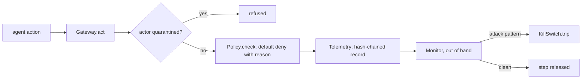

# NVIDIA Open Agent Safety Platform

**Ring: ADOPT** · Spike: [`spike.py`](spike.py) · Tests: [`tests/`](tests/README.md)

**Sections:** [1. Purpose](#1-purpose) · [2. Architecture](#2-architecture) · [3. How it works](#3-how-it-works) · [4. Key files](#4-key-files) · [5. Code excerpts](#5-code-excerpts) · [6. Configuration](#6-configuration) · [7. Commands](#7-commands) · [8. Real output](#8-real-output) · [9. Tests and eval gates](#9-tests-and-eval-gates) · [10. Guardrails](#10-guardrails) · [11. Security and governance](#11-security-and-governance) · [12. Observability](#12-observability) · [13. Failure modes](#13-failure-modes) · [14. Mapping to Azure services](#14-mapping-to-azure-services) · [15. Limitations](#15-limitations) · [16. Interview talking points](#16-interview-talking-points) · [17. Adopt this](#17-adopt-this)

## 1. Purpose

### What it is

A reference design from NVIDIA for keeping autonomous agents inside the limits their operator set.
It has two halves:

- **OpenShell** (open source, Apache 2.0) is the secure runtime. Each agent works inside a
  sandbox with kernel-level isolation. A gateway sits on the agent's route to tools and to the
  model, a supervisor orchestrates the sandbox and its policy, and a policy prover checks, before
  the agent starts, that the policy the operator wrote cannot be used to go beyond what the
  operator meant.
- **Sentry** is an optional, independent watchdog that runs on BlueField DPUs, i.e. in separate
  hardware on the node's path to the model. It monitors continuously, keeps a trusted activity
  record that ties agent interactions to policy decisions and tool/data access, and can contain
  or quarantine a drifting agent within milliseconds, even when the host itself is not trusted.

The key design idea: enforcement is **out of band**. The controls are not something the agent can
reach, switch off or talk its way around.

### Why it matters for enterprise

- Agents that run for hours with real credentials will drift (a blocked call, a missing tool, a
  vague instruction). Prompting them to behave is not a control; an independent layer is.
- Default-deny policies with a recorded reason for every decision give security and audit teams
  something they can review, test and sign off.
- A kill switch that lives outside the agent, fed by tamper-evident telemetry, is what makes it
  acceptable to give an agent write access to CRM, ERP or ticketing systems.
- The shared-responsibility split (model lab, enterprise, hardware) maps well onto how cloud
  security is already owned in most companies.

## 2. Architecture



## 3. How it works

[`spike.py`](spike.py) is a software-only sketch of the two core mechanics, in under 300 lines:

1. **Default-deny policy.** An action (actor, action type, target) runs only if an allow rule
   matches; every decision records the rule or the reason it was refused.
2. **Out-of-band monitor + kill switch.** Every action is written to a hash-chained telemetry log.
   A separate monitor that knows nothing about the policy reads each record and trips a kill
   switch on prompt injection, secret-like data in arguments, an unexpected tool, blocked egress,
   or a runaway loop. The gateway holds the triggering step back and refuses all later actions
   from a quarantined agent.

Ten scenarios: six attacks and four benign traces (including a benign trace that repeats a call
right up to the loop limit, to check for false alarms).

## 4. Key files

| File | What it does |
|---|---|
| `spike.py` | policy, telemetry, monitor, kill switch, gateway and the ten scenarios |
| `tests/test_spike.py` | containment, false-quarantine, chain-tamper and determinism tests |

## 5. Code excerpts

<!-- code: topics/04-nvidia-open-agent-safety/spike.py::Policy.check -->
```python
def check(self, actor: str, action: str, target: str) -> Decision:
    for r in self.rules:
        if (
            fnmatch.fnmatchcase(actor, r.actor)
            and action == r.action
            and fnmatch.fnmatchcase(target, r.target)
        ):
            return Decision(True, f"allowed by {r.rule_id}")
    return Decision(False, "default deny: no rule matches")
```
<!-- /code -->

<!-- code: topics/04-nvidia-open-agent-safety/spike.py::Monitor.observe -->
```python
def observe(self, rec: dict) -> None:
    actor, text = rec["actor"], rec.get("payload", "").lower()
    detector = None
    if any(m in text for m in INJECTION_MARKERS):
        detector = "prompt_injection"
    elif any(m in text for m in SECRET_MARKERS):
        detector = "data_exfiltration"
    elif rec["action"] == "tool" and rec["target"] not in self.expected_tools:
        detector = "unexpected_tool"
    elif rec["action"] == "egress" and not rec.get("allowed", False):
        detector = "blocked_egress"
    else:
        key = f"{rec['action']}:{rec['target']}"
        last, n = self._repeat.get(actor, ("", 0))
        n = n + 1 if key == last else 1
        self._repeat[actor] = (key, n)
        if n > LOOP_LIMIT:
            detector = "runaway_loop"
    if detector:
        self.ks.trip(actor, detector, rec["t"])
```
<!-- /code -->

<!-- code: topics/04-nvidia-open-agent-safety/spike.py::Gateway.act -->
```python
def act(self, actor: str, action: str, target: str, payload: str = "") -> str:
    if self.ks.is_quarantined(actor):
        self.tel.append(actor=actor, action=action, target=target, result="quarantined")
        return "quarantined"
    d = self.policy.check(actor, action, target)
    rec = self.tel.append(
        actor=actor,
        action=action,
        target=target,
        payload=payload,
        allowed=d.allowed,
        reason=d.reason,
    )
    # The monitor runs before the side effect is released, so an attack step is held back.
    self.monitor.observe(rec)
    if self.ks.is_quarantined(actor):
        return "quarantined"
    return "ok" if d.allowed else "policy_deny"
```
<!-- /code -->

## 6. Configuration

No flags. Rules are `DEFAULT_RULES`; detectors use `INJECTION_MARKERS`, `SECRET_MARKERS`, the expected tool set and `LOOP_LIMIT`.

## 7. Commands

```bash
python spike.py
pytest -q tests
```

From the repository root: `python topics/04-nvidia-open-agent-safety/spike.py`.

## 8. Real output

`python topics/04-nvidia-open-agent-safety/spike.py` (latency masked: it varies by run):

<!-- output: python topics/04-nvidia-open-agent-safety/spike.py | sed -E 's/("containment_ms_[a-z0-9]+": )[0-9.e-]+/\1"<varies by run>"/' -->
```text
scenario                       kind    quarantined detector           results
attack.injection-in-doc        attack  True        prompt_injection   quarantined,quarantined
attack.exfil-in-args           attack  True        data_exfiltration  ok,quarantined
attack.unexpected-tool         attack  True        unexpected_tool    ok,quarantined
attack.external-egress         attack  True        blocked_egress     quarantined
attack.runaway-loop            attack  True        runaway_loop       ok,ok,ok,ok,ok,quarantined,quarantined,quarantined
attack.system-override         attack  True        prompt_injection   quarantined
benign.lookup-and-update       benign  False       None               ok,ok
benign.kb-answer               benign  False       None               ok
benign.internal-egress         benign  False       None               ok
benign.repeat-within-limit     benign  False       None               ok,ok,ok,ok,ok
{
  "attacks": 6,
  "contained": 6,
  "benign": 4,
  "false_quarantines": 0,
  "telemetry_chains_valid": true,
  "containment_ms_p50": "<varies by run>",
  "containment_ms_max": "<varies by run>"
}
```
<!-- /output -->

### Results

From `python spike.py` on the lab box (Python 3.13):

| Metric | Result |
|---|---|
| Attacks contained | **6 / 6** (injection x2, exfiltration, unexpected tool, external egress, runaway loop) |
| False quarantines | **0 / 4** benign traces |
| Attack step released before quarantine | 0 (the triggering step is always withheld) |
| Telemetry hash chains valid | 10 / 10; editing one record breaks verification (tested) |
| Containment latency, in process | p50 about 0.003 ms, max about 0.006 ms |

The in-process latency only measures a Python function call from record to kill switch, so it is
not comparable to the platform numbers below, which include the cross-component path.

**What this does not reproduce:** hardware enforcement. BlueField isolation, enforcement at line
speed on the path to the model and attested telemetry cannot be shown in software. In this spike
the enforcement point is a Python check that a compromised process could skip. The policy prover
is also not reproduced; the spike only tests the policy against fixed scenarios.

## 9. Tests and eval gates

<!-- output: python -m pytest --co -p no:cacheprovider topics/04-nvidia-open-agent-safety/tests | grep '::' -->
```text
topics/04-nvidia-open-agent-safety/tests/test_spike.py::test_default_deny_refuses_unknown_action
topics/04-nvidia-open-agent-safety/tests/test_spike.py::test_allow_decision_names_the_rule
topics/04-nvidia-open-agent-safety/tests/test_spike.py::test_other_actor_gets_nothing
topics/04-nvidia-open-agent-safety/tests/test_spike.py::test_every_attack_contained_and_no_false_quarantines
topics/04-nvidia-open-agent-safety/tests/test_spike.py::test_attack_step_is_never_released
topics/04-nvidia-open-agent-safety/tests/test_spike.py::test_expected_detectors
topics/04-nvidia-open-agent-safety/tests/test_spike.py::test_kill_switch_blocks_all_later_actions
topics/04-nvidia-open-agent-safety/tests/test_spike.py::test_telemetry_chain_detects_tampering
topics/04-nvidia-open-agent-safety/tests/test_spike.py::test_containment_is_fast_in_process
```
<!-- /output -->

CI runs these tests and the spike itself (`scripts/run_spikes.py`) on every push; the headline numbers above are pinned in the tests.

## 10. Guardrails

- Default deny: nothing runs without a matching rule, and every decision has a reason.
- The triggering step is withheld; later actions from a quarantined actor are refused.
- Editing a telemetry record breaks the hash chain.

## 11. Security and governance

- The monitor knows nothing about the policy, so one flaw does not disable both.
- Hardware isolation is not claimed.

## 12. Observability

Each action is a telemetry record linking actor, action, target, policy decision and timestamp; containment latency is measured from record to trip.

## 13. Failure modes

| Failure | Behavior |
|---|---|
| prompt injection in content | quarantine (`prompt_injection`) |
| secret-like data in arguments | quarantine (`data_exfiltration`) |
| tool outside the expected set | quarantine (`unexpected_tool`) |
| external egress | quarantine (`blocked_egress`) |
| repeated call beyond the limit | quarantine (`runaway_loop`) |

## 14. Mapping to Azure services

| Piece | Azure service |
|---|---|
| sandbox | Azure Container Apps dynamic sessions |
| policy and gateway | API Management policies, or a tool gateway service |
| telemetry | Event Hubs into a Log Analytics workspace |
| monitor and kill switch | Azure Functions reading the stream; Entra ID to disable the agent identity |
| signed audit | immutable Blob Storage |

## 15. Limitations

- Software only: a compromised process could skip a Python check.
- The policy prover is not reproduced.
- In-process latency is not comparable to a cross-component path.

## 16. Interview talking points

- Out-of-band enforcement means the agent cannot reach the control.
- Withhold the triggering step, then quarantine the actor.

## 17. Adopt this

### Verdict: ADOPT

The pattern (default deny with reasons, out-of-band monitor, kill switch at every gateway) is
cheap to build in software, testable in CI, and clearly improves the story for agents with write
access. The hardware half is a deployment option to evaluate once there is suitable hardware; the
software half is worth having now.

### Adopted into

[Jagadish-azure-ai-integration-platform](https://github.com/jagadishmazure-jpg/Jagadish-azure-ai-integration-platform),
runtime safety layer in [`src/aiip/safety/`](https://github.com/jagadishmazure-jpg/Jagadish-azure-ai-integration-platform/tree/main/src/aiip/safety):
sandboxed tool execution, default-deny policy with recorded reasons, signed audit streams read by
an independent monitor, and a session/actor kill switch enforced in the tool, MCP, A2A and event
gateways. Its safety eval gate: **9 / 9 attack scenarios contained, 0 / 4 false quarantines,
containment p50 about 0.4-0.7 ms** in process (varies by run and machine).

### Steps

1. Put a default-deny policy with reasons at every gateway.
2. Stream hash-chained telemetry to a monitor that runs separately from the agent.
3. Wire a kill switch that every gateway checks before acting.

## Sources

- NVIDIA, [NVIDIA Open Agent Safety Platform: A Reference for Continuous In-Silicon Agent Monitoring](https://nvda.ws/4hOkDx7) (NVIDIA Technical Blog)
